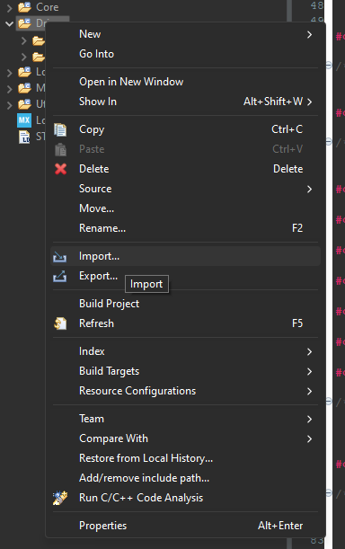
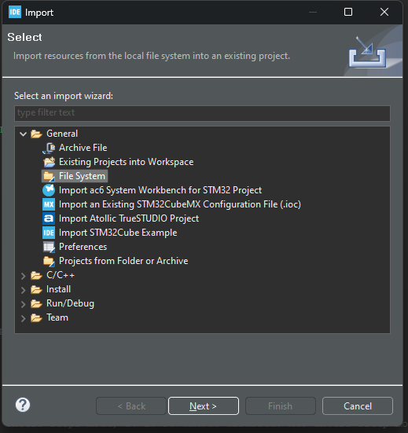
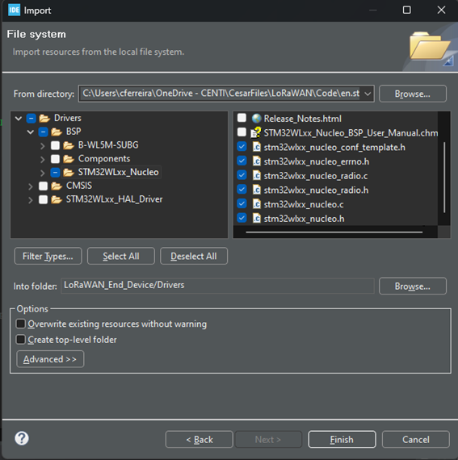
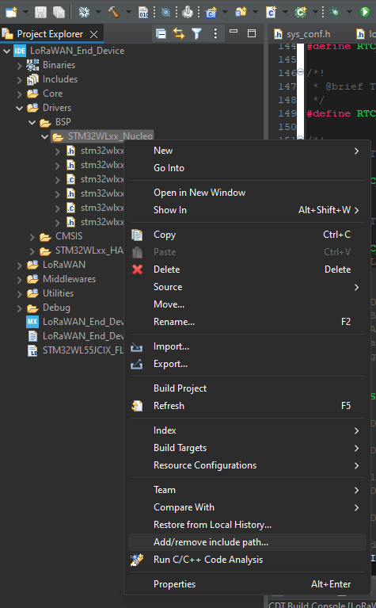

# Template project

This project implements a single core LoRaWAN end device with STM32 sequencer. Project was created in STM32CubeIDE v1.13.1.

## Communication Parameters
- LoRaWAN version: 1.0.4
- Region EU868 
- TX Duty cycle: 5 sec
- LoRaWAN user port: 2
- Device class: A
- ADR off
- Data rate: 5
- TX Power: 0
- Device activation type: OTAA

## Generate your own project 

To create the LoRaWAN end device from skretch without using directly the template project, the following steps should be followed:

- ### Create project from existing .ioc file
    -  Use the .ioc file of the project.
    - When prompted, generate code

- ### Manually add BSP driver
    - Since Sub-GHz is hardware agnostic, the Board Support Package is required to control the RF Switch;
    - In project tree -> right-click on "Drivers" folder and select "Import":
        

            
        
 
    - After that, expand "General" -> click "File System":
        

            
        
 
    - Then select .c and .h files and click "Finish":
        

            
        
 
    - Rename "stm32wlxx_nucleo_conf_template.h" file to "stm32wlxx_nucleo_conf.h".
    - Before code compiling, the directory containing the BSP files must be added to the list of include directories. For that, right-click on "STM32WLxx_Nucleo" folder and select "Add/remove include path..". A window will pop-up. ENsure both Debug and Release options are checked.
        

            
        
 
    
- ### After these steps, compile it!