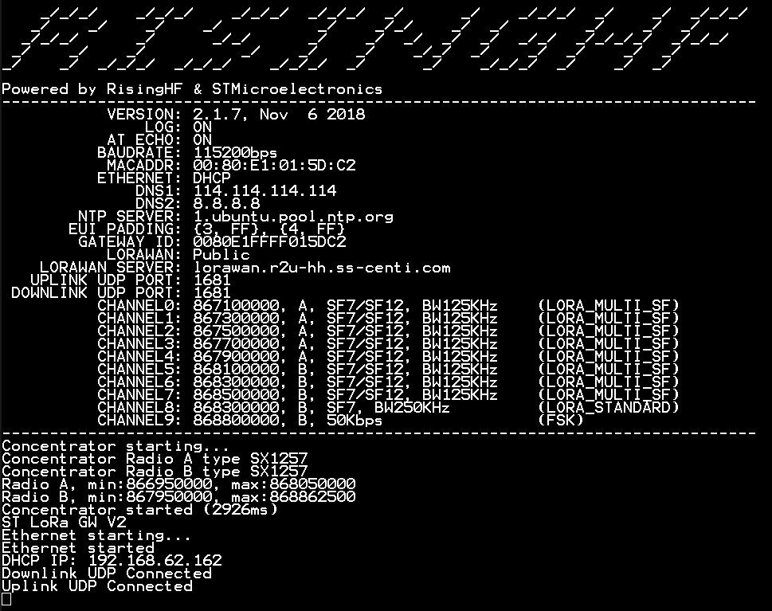

# STM32 LoRaWAN Gateway

The LoRaWAN gateway from STM32 is based on NUCLEO-F746ZG development board and RisingHF LRWAN_GS_HF1 expansion board (Concentrator Card).
        

            
        
 

Hereafter, necessary steps to use LoRaWAN Gateway from STM32 are presented. 

## Programming and Parametrizing Gateway

To use the STM32 gateway, the following steps should be followed:

### 1. Program gateway
    -  Using STM32CubeProgrammer, program the gateway with the .bin file located at the "Bin" folder. 

### 2. Configure gateway
LoRaWAN gateways should be configured to be able to forward packets to the LoRaWAN network server. Below are two ways to configure LoRaWAN gateways, depending on the Gotthard implementation.

#### Connect gateway to Docker-based Gotthard
The STM32 LoRaWAN gateway is configured through AT commands. Initial configuration requires the following parametrization: 

- Define gateway MAC Address: AT + MAC = [MAC Address]
- Define the LoRaWAN server, uplink/downlink UDP port: AT + PKTFWD = [server addres,port_up,port_down]
- If necessary change channels (it should be already configured): AT + CH
- At the end of configuration, reset gateway: AT + RESET
- If necessary AT + Help to find remaining commands

The gateway log after configuration should be similar to:
        

            
        
 

#### Connect gateway to local-based Gotthard
If the Gotthard LoRaWAN server is locally implemented, we should follow the next steps:

- Change ethernet configurations in such way the gateway can "see" the server:
        

            
        
 
- Define gateway MAC Address: AT + MAC = [MAC Address]
- Change IP to static and define IP, netmask and gateway: AT + IP = [IP, netmask, gateway] -> AT + IP = STATIC, 192.168.1.7, 255.255.255.0, 192.168.1.5
- If necessary change channels (it should be already configured): AT + CH
- At the end of configuration, reset gateway: AT + RESET
- If necessary AT + Help to find remaining commands
